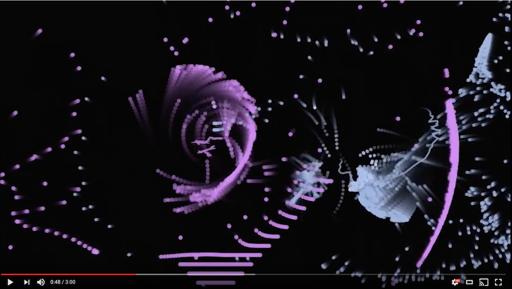
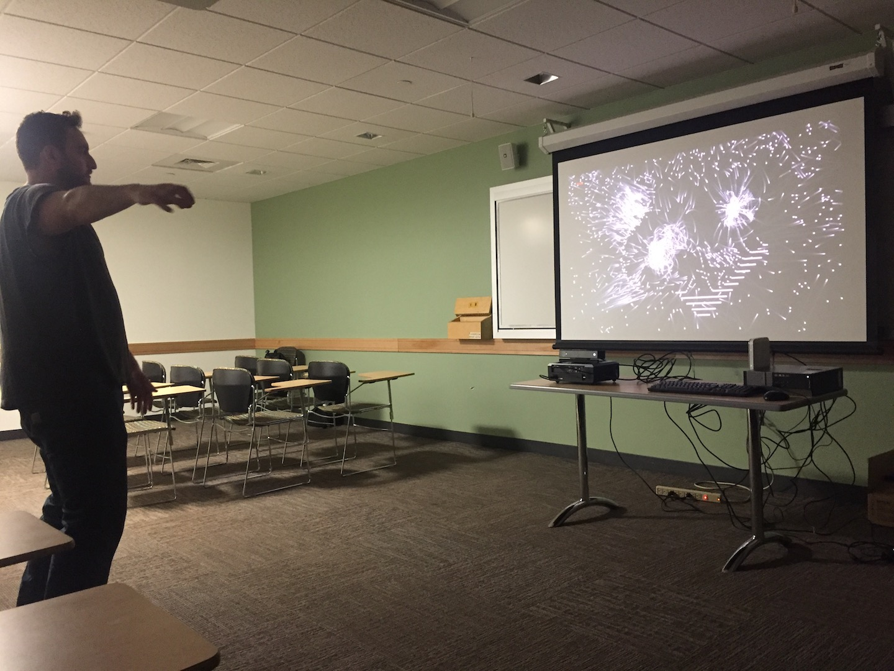
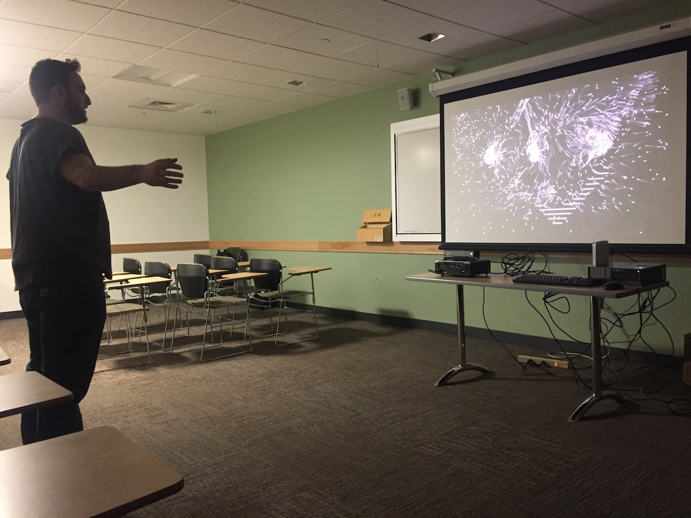
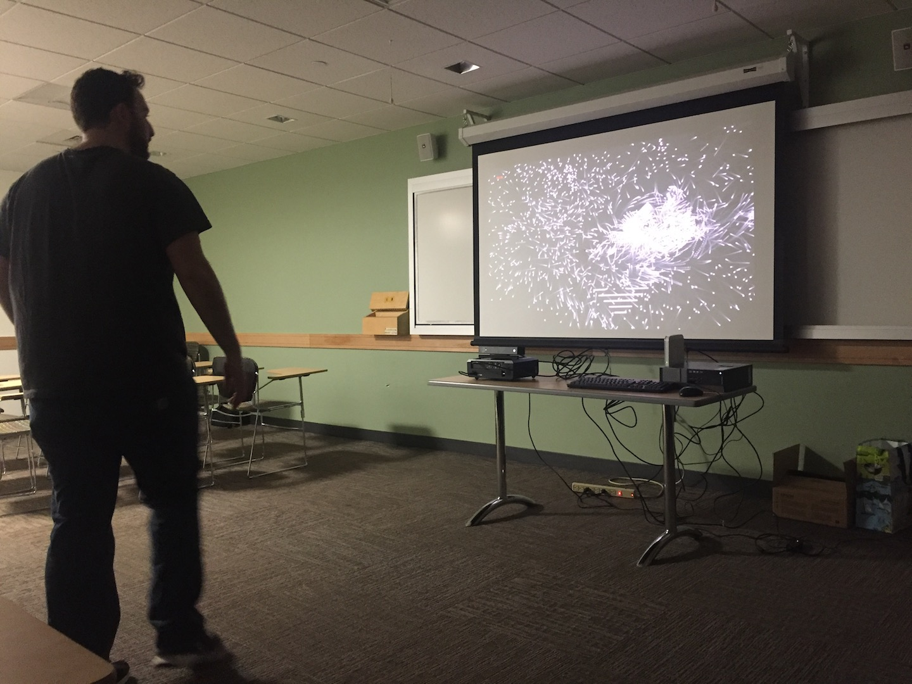
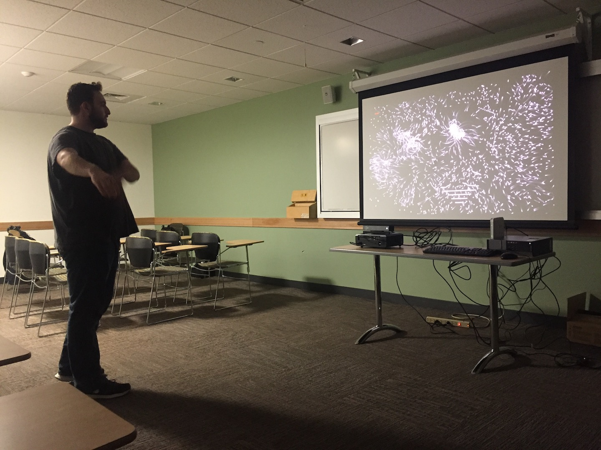

# Capstone / Light Loops
This project was initiated in the Fall of 2016 for Northeastern University's ARTG4700: Interaction Team Degree Project. The group organically formed around the idea of wanting to build something that didn't have a clearly defined purpose – instead the purpose would come from the process of building it and the experiences had from using it. Everything we're making here is generative. We want every experience to be unlike any other. 

We presented this project at Northeastern's Gallery 360 for the 2017 Senior Showcase and MFA Thesis. 

Here's a sequence of images of a user testing our prototype installation (24 Feb 2017):

This readme will be periodically updated with high-level information. See the issues page and wiki for further details.

## Tech Stack
- Hardware
  - ~2012 Dell Desktop
  - Short Throw Projector
  - Kinect for Xbox One
  - Stereo Speakers
- Software
  - Windows 10
  - Kinect V2 SDK
  - Processing 3
  - Max/MSP

## Team
- Nick Alekhine
- Adrian Bjune
- Nathan Hulsey
- Charles Perrone